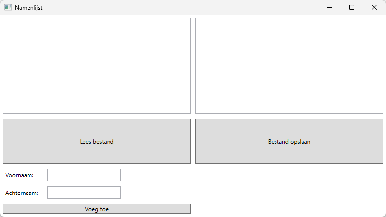

# Labo - Namenlijst



### Voeg toe
De knop "Voeg Toe" voegt de voornaam en achternaam die ingevoerd worden in de tekstboxen, toe aan de twee lijsten van namen op het scherm.
> [!TIP] 
> Controleer of beide tekstboxen zijn ingevuld.

### Bestand opslaan
De knop "Bestand opslaan" slaat al de namen (die momenteel getoond worden in de twee kolommen) op in het bestand "personen.txt".
> [!TIP] 
> Gebruik een for loop (en geef foreach!) om beide listboxen te kunnen uitlezen.

### Lees bestand
De knop "Lees Bestand" leest het bestand "personen.txt" en toont de namen in de overeenkomstige listboxen.

> [!TIP] 
> Gebruik de Split method om de gelezen regel in 2 te splitsen (voornaam en achternaam).

### XAML
```
<Grid>
    <Grid.ColumnDefinitions>
        <ColumnDefinition/>
        <ColumnDefinition/>
    </Grid.ColumnDefinitions>
    <Grid.RowDefinitions>
        <RowDefinition Height="2*"/>
        <RowDefinition/>
        <RowDefinition/>
    </Grid.RowDefinitions>
    <ListBox Name="firstNameListBox" Grid.Row="0" Grid.Column="0" Margin="5"></ListBox>
    <Button Name="readFileButton" Content="Lees bestand" Grid.Row="1" Grid.Column="0" Margin="5" Click="readFileButton_Click"/>
    <ListBox Name="lastNameListBox" Grid.Row="0" Grid.Column="1" Margin="5"></ListBox>
    <Button Name="saveFileButton" Content="Bestand opslaan" Grid.Row="1" Grid.Column="1" Margin="5" Click="saveFileButton_Click"/>
    <StackPanel Grid.Row="2" Grid.Column="0">
        <WrapPanel>
            <Label Name="firstNameLabel" Content="Voornaam:" Margin="5" MinWidth="80"/>
            <TextBox Name="firstNameTextBox" Margin="5" MinWidth="150"/>
        </WrapPanel>
        <WrapPanel Grid.Row="2" Grid.Column="1">
            <Label Name="lastNameLabel" Content="Achternaam:" Margin="5" MinWidth="80"/>
            <TextBox Name="lastNameTextBox" Margin="5" MinWidth="150"/>
        </WrapPanel>
        <Button Name="addButton" Content="Voeg toe" Grid.Row="2" Grid.Column="1" Margin="5" Click="addButton_Click"/>
    </StackPanel>
</Grid>
```
